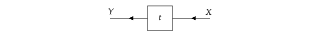

# [Category Theory](@id category)

In the following, we will focus on structure of the tensor fusion categories, and describe it in an informal way. We also explain how this package realizes this structure. For more concrete mathematical definitions of general categories, please refer to the attached note and references listed at the end of this section.

To make the explanations easier to understand, we give examples for a vector space without additional structure and the group theory which is familiar to most of readers.

The structure of category theory contains two important concepts: objects and morphisms. The morphisms are the maps between objects.

In the language we use, we define tensors as morphisms, and we assume the space of the morphisms is a complex vector space. The objects are living on the tensor legs, which does not need to be vector spaces.

Graphically, we draw the tensor map as

In the applications of category in quantum physics, the objects correspond to the Hilbert space. We will use the modern way to represent a physical states which is represented by a map, for example, and density matrix.

[Vect] The objects are vector spaces without additional structure.

[Group] The objects are the representation spaces of group.

The backbone of a category is the set of simple objects. The morphism from one simple object to itself is isomorphic to identity morphism, and there is no m. Every object is a direct sum of simple objects. The ma

# [Reference](@id_reference)
[^TensorKit]: https://github.com/Jutho/TensorKit.jl

[^TeNPy]: https://github.com/tenpy/tenpy

[^MPSKit]: https://github.com/maartenvd/MPSKit.jl
